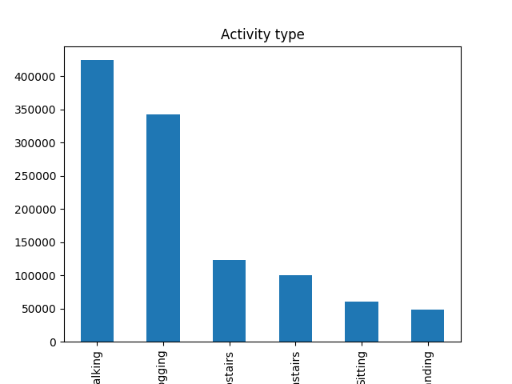
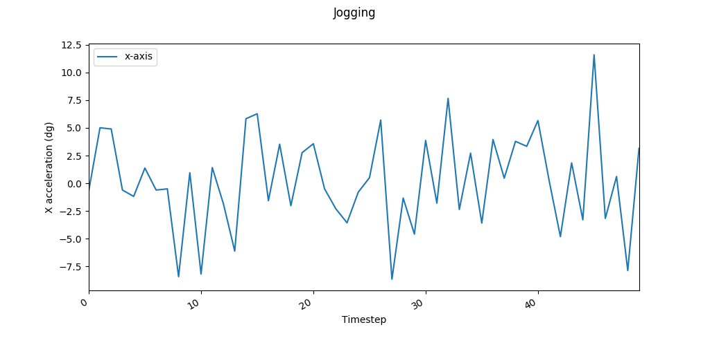
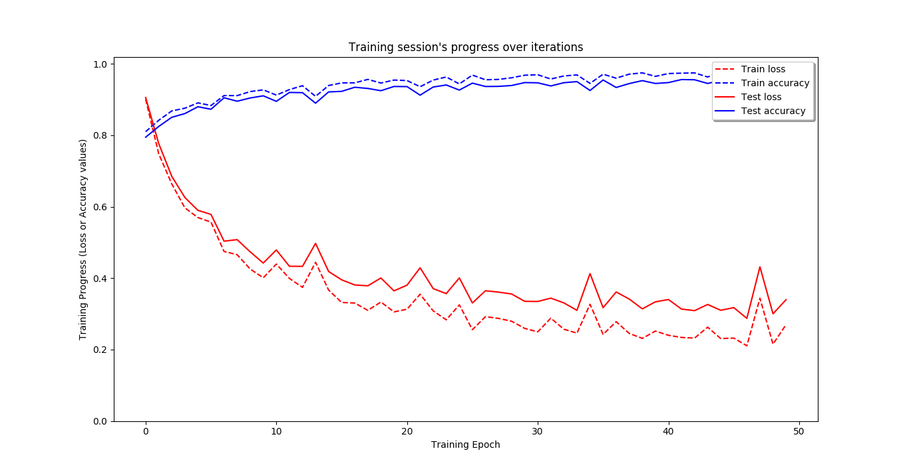
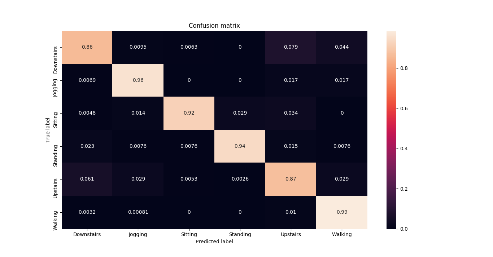
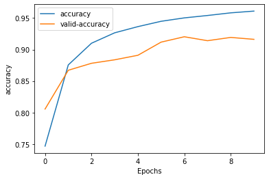
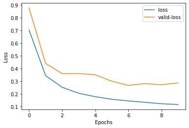
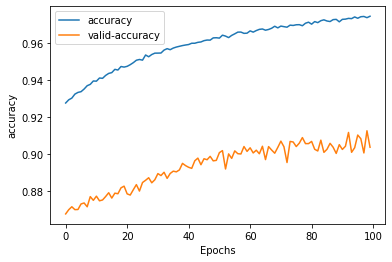
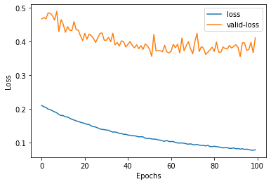

# Human Activity Recognition on the Wireless Sensor Data Mining (WISDM) dataset using LSTM Recurrent Neural Networks  
This repository cotains code used to recognize human activity based on the Wireless Sensor Data Mining (WISDM) dataset using LSTM (Long short-term memory) and is heavily based on the article by [Venelin Valkov](https://medium.com/@curiousily/human-activity-recognition-using-lstms-on-android-tensorflow-for-hackers-part-vi-492da5adef64).

[This repository](https://github.com/bartkowiaktomasz/har-wisdm-bidirectional-lstm-rnns) contains an improved version of the model, where _Bidirectional LSTM_ is used with _Bayesian Optimization_ to find optimal architecture.

## Dataset
The data used for classification is provided by the Wireless Sensor Data Mining (WISDM) Lab and can be downloaded  [here](http://www.cis.fordham.edu/wisdm/dataset.php).
It consists of _1,098,207_ examples of various physical activities (sampled at _20Hz_) with _6_ attributes:
`user,activity,timestamp,x-acceleration,y-acceleration,z-acceleration`, and the _activities_ include: `Walking, Jogging, Upstairs, Downstairs, Sitting, Standing`. 

Original research done on this dataset can be found [here](http://www.cis.fordham.edu/wisdm/public_files/sensorKDD-2010.pdf).

##  Data preprocessing
The following graph shows how the _x-acceleration_ was changing with time (or more accurately - at each timestep) for _Jogging_.
 
In order to feed the network with such temporal dependencies a _sliding time window_ is used to extract separate data segments. The _window width_ and the _step size_ can be both adjusted and optimised for better accuracy. Each time step is associated with an activity label, so for each _segment_ the most frequently appearing label is chosen. Here, the _time segment_ or _window width_ is chosen to be _200_ and _time step_ is chosen to be _100_.

### Input:
- data _(data/WISDM_ar_v1.1_raw.txt)_

The data needs to be separated into features and labels and then further into training and test sets. Labels need to be _one-hot_ encoded before feeding into the classifier.

### Output:
- Trained classifier
- Confusion matrix graph
- Error/Accuracy rate graph

## LSTMs
Long short-term memory (LSTM) Recurrent Neural Networks (RNNs) are used to model temporal data (i.e. speech recognition, NLP, human activity recognition), where there is a need to keep some state information. More info on LSTMs can be found [here](https://colah.github.io/posts/2015-08-Understanding-LSTMs/).

## Results
The classifier achieves the accuracy of _94%_, though it might presumably be slightly improved by decreasing the _step size_ of _sliding window_.
The following graphs show the train/test error/accuracy for each epoch and the final confusion matrix (normalised so that each row sums to one).
 

### Dependencies
- matplotlib 1.5.3
- seaborn 0.8.1
- numpy 1.14
- pandas 0.20.3
- scikit-learn 0.19.1
- tensorflow 1.5.0

### Use
1. Run the script with  `python3 HAR_Recognition.py`

## CNN Classification

### Results

 

## Convolutional Autoencoder Classification

### Results

 

